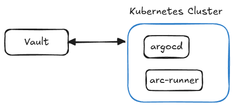

# Kubernetes GitOps & DevOps Lab Setup

This repository contains the configuration guides and manifests for setting up a complete self-hosted GitOps and DevOps lab environment on Kubernetes.

---

## 🛠️ Lab Components

The lab is divided into the following key components:

### 1. K8s Setup ([ansible-kubeadm-k8s](https://github.com/gulcht/ansible-kubeadm-k8s))
- Automates the creation of a Kubernetes cluster using Ansible and `kubeadm`.

### 2. [ArgoCD Setup](/argocd-setup/README.md)
- Deploys ArgoCD in the Kubernetes cluster for GitOps continuous delivery.
- Explains how to set up the namespace, apply manifests server-side, retrieve the initial admin credentials, and expose the UI using an Ingress rule.

### 3. [Vault Self-Hosted Setup](/vault-self-hosted/README.md)
- Installs and configures HashiCorp Vault running **externally (outside of the Kubernetes cluster)**.
- Explains how to configure TLS using self-signed certs, start the server using a Raft storage backend, initialize/unseal the Vault, and monitor status.

### 4. [ARC (Actions Runner Controller) Setup](/arc-runner-setup/README.md)
- Deploys the Actions Runner Controller in the Kubernetes cluster.
- Configures it with a GitHub Personal Access Token (PAT) to scale self-hosted runner pods dynamically to run GitHub Actions workflows.

---

## 🔄 Workflow Integration

1. **CI Pipeline**: Developers push code (e.g., Rust applications) to GitHub.
2. **Self-Hosted Runner**: GitHub triggers a workflow that runs on our Kubernetes-based self-hosted runners managed by **ARC**.
3. **Secrets Management**: Workflows securely fetch secrets from **Vault** (running externally).
4. **GitOps Delivery**: Once the container image is built and pushed, **ArgoCD** synchronizes the desired state from Git to the Kubernetes cluster automatically.

